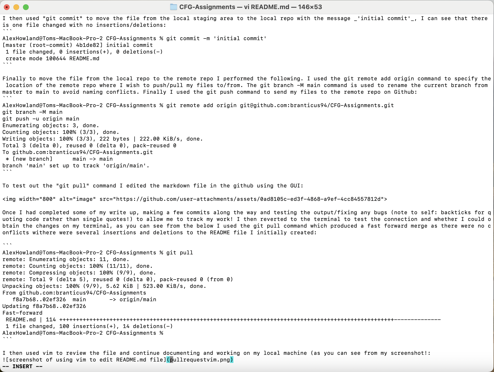

# CFGDegree-Foundation-Module-Assignments

- [About Me](#woman-about-me)
- [Previous CFG Degree Projects](#previous-cfg-degree-projects)
- [How I will be using Github for this assignment](#how-i-will-be-using-github-for-this-assignment)
- [Creating a .gitignore, explaining what it is for! (What poetry! 📚)](https://github.com/branticus94/CFG-Assignments/edit/main/README.md#creating-a-gitignore-explaining-what-it-is-for)

# :woman: **About Me!**

> [!WARNING]
> Have tried to use as many markdown (and github flavoured markdown) features as possible so that I can refer to this page at a later date, please note this may elicit a sense that your timeline has reverted to the 1990s when myspace was a thing and people tried to make their page look as fancy as possible by using every known feature!

## Name
Alexandra aka ~~Branticus94 (please don't laugh at my username I made it circa 2019 when I was first dabbling with code, unmarried (hence Brant), using a nickname I was adorned with during my school years when I was rather fond of greek/roman history and mythology, think: this is sparta)~~ 'Alex' Howland

## Fun Facts

Proud mom to a beautiful 4 month old boy named Charlie[^1] 
> [!CAUTION]
> ***SPOILER: baby SPAM alert***, reveal collapsed section at your own mercy

  <details>
    
  <summary>👶🍼 Peekaboo!</summary>
  
  
    
  </details>

[^1]: Who very recently went on his first canoe journey

Favourite colour: $${\color{rgba(255, 223, 0, 0.8)}Yellow}$$ (Cool! Github released Tex support and now allow you to add colours to the markdown... oops I mean *colors* as I'm a coder now :smiley: ooooo, and smileys hello :eyes:)

Favourite coding related quote:
  > \"It’s not a bug; it’s an undocumented feature. Anonymous\"

Favourite 5 cuisines in order of preference:
1. Indian 
2. Thai
3. Italian
4. Mexican
5. Ethiopian

> [!NOTE]
> This list is not exhausitive, will eat any and all food 😆.

# Previous CFG Degree Projects


# How I will be using Github for this assignment
I will be using Github for this assignment as a remote repository to store code. 

In order to fulfil the requirements I needed to create a repo on github named CFG-Assignments. I created the repo with the built in GUI in Github:


I then used the computer terminal to create my file for upload to the remote repo. I first navigated  to the folder I wish to create my folder in using  the "cd" command (change directory), my preferred folder being documents. I checked I was in the correct directory with "ls" (list) command: 

```
AlexHowland@Toms-MacBook-Pro-2 ~ % ls
Applications	Documents	Library		Music		Public
Desktop		Downloads	Movies		Pictures	PycharmProjects
AlexHowland@Toms-MacBook-Pro-2 ~ % cd Documents
AlexHowland@Toms-MacBook-Pro-2 Documents % ls
CFG Degree		CFG Python		CV and Job Applications
```

Once  I was in the correct location I made a directory using the "mkdir" command, naming the directory CFG-Assignments, again checking the output of my code as I went:

```
AlexHowland@Toms-MacBook-Pro-2 Documents % mkdir CFG-Assignments
AlexHowland@Toms-MacBook-Pro-2 Documents % ls
CFG Degree		CFG-Assignments
CFG Python		CV and Job Applications
```

Once the folder was created I used the "cd" command to change directory to within the folder, followed by the "git init" command to initialise git within the directory:
```
AlexHowland@Toms-MacBook-Pro-2 Documents % cd CFG-Assignments
AlexHowland@Toms-MacBook-Pro-2 CFG-Assignments % git init
hint: Using 'master' as the name for the initial branch. This default branch name
hint: is subject to change. To configure the initial branch name to use in all
hint: of your new repositories, which will suppress this warning, call:
hint: 
hint: 	git config --global init.defaultBranch <name>
hint: 
hint: Names commonly chosen instead of 'master' are 'main', 'trunk' and
hint: 'development'. The just-created branch can be renamed via this command:
hint: 
hint: 	git branch -m <name>
Initialized empty Git repository in /Users/AlexHowland/Documents/CFG-Assignments/.git/
```

I created a readme file using the "touch" command, confirming the output with the "ls" command:
```
AlexHowland@Toms-MacBook-Pro-2 CFG-Assignments % touch README.md
AlexHowland@Toms-MacBook-Pro-2 CFG-Assignments % ls
README.md
```

I then checked the git status, as you can see I am on the master/main branch, there have been no commits and I have one untracked file, the README.md file.  
```
AlexHowland@Toms-MacBook-Pro-2 CFG-Assignments % git status
On branch master

No commits yet

Untracked files:
  (use "git add <file>..." to include in what will be committed)
	README.md

nothing added to commit but untracked files present (use "git add" to track)
```

I used the ''git add'' command to move my file from the local working directory into the local staging area to prepare for  the commit, using the "git status" command you can see I now have one file to be committed:
```
AlexHowland@Toms-MacBook-Pro-2 CFG-Assignments % git add README.md
AlexHowland@Toms-MacBook-Pro-2 CFG-Assignments % git status  
On branch master

No commits yet

Changes to be committed:
  (use "git rm --cached <file>..." to unstage)
	new file:   README.md
```

I then used "git commit" to move the file from the local staging area to the local repo with the message _'initial commit'_, I can see that there is one file changed with no insertions/deletions:
```
AlexHowland@Toms-MacBook-Pro-2 CFG-Assignments % git commit -m 'initial commit'
[master (root-commit) 4b1de82] initial commit
 1 file changed, 0 insertions(+), 0 deletions(-)
 create mode 100644 README.md
```

Finally to move the file from the local repo to the remote repo I performed the following. I used the git remote add origin command to specify the location of the remote repo where I wish to push/pull my files to/from. The git branch -M main command is used to rename the current branch from master to main to avoid naming conflicts. Finally I used the git push command to send my files to the remote repo on Github: 
```
AlexHowland@Toms-MacBook-Pro-2 CFG-Assignments % git remote add origin git@github.com:branticus94/CFG-Assignments.git
git branch -M main
git push -u origin main
Enumerating objects: 3, done.
Counting objects: 100% (3/3), done.
Writing objects: 100% (3/3), 222 bytes | 222.00 KiB/s, done.
Total 3 (delta 0), reused 0 (delta 0), pack-reused 0
To github.com:branticus94/CFG-Assignments.git
 * [new branch]      main -> main
branch 'main' set up to track 'origin/main'.
```

To test out the "git pull" command I edited the markdown file in the github using the GUI:


Once I had completed some of my write up, making a few commits along the way and testing the output/fixing any bugs (note to self: backticks for quoting code rather than single quotes!) to allow me to track my work! I then reverted to the terminal to test the connection and whether I could obtain the changes on my terminal, as you can see from the below I used the git pull command which produced a fast forward merge as there were no conflicts withere were several insertions and deletions to the README file I initially created: 

```
AlexHowland@Toms-MacBook-Pro-2 CFG-Assignments % git pull
remote: Enumerating objects: 11, done.
remote: Counting objects: 100% (11/11), done.
remote: Compressing objects: 100% (9/9), done.
remote: Total 9 (delta 5), reused 0 (delta 0), pack-reused 0 (from 0)
Unpacking objects: 100% (9/9), 5.62 KiB | 523.00 KiB/s, done.
From github.com:branticus94/CFG-Assignments
   f8a7b68..02ef326  main       -> origin/main
Updating f8a7b68..02ef326
Fast-forward
 README.md | 114 ++++++++++++++++++++++++++++++++++++++++++++++++++++++++++++++++++++++++++++++++++++++++++++++++++++--------------
 1 file changed, 100 insertions(+), 14 deletions(-)
AlexHowland@Toms-MacBook-Pro-2 CFG-Assignments % 
```

I then used vim to review the file and continue documenting and working on my local machine (as you can see from my screenshot!:


I then repeated the process (getting a little quicker this time!) to send my local changes back to Github! So happy that I've managed to make it communicate both ways 😄

```
AlexHowland@Toms-MacBook-Pro-2 CFG-Assignments % vi README.md
AlexHowland@Toms-MacBook-Pro-2 CFG-Assignments % git status
On branch main
Your branch is up to date with 'origin/main'.

Changes not staged for commit:
  (use "git add <file>..." to update what will be committed)
  (use "git restore <file>..." to discard changes in working directory)
	modified:   README.md

Untracked files:
  (use "git add <file>..." to include in what will be committed)
	pullrequestvim.png

no changes added to commit (use "git add" and/or "git commit -a")
AlexHowland@Toms-MacBook-Pro-2 CFG-Assignments % git add .
AlexHowland@Toms-MacBook-Pro-2 CFG-Assignments % git commit -m 'edited README.md describing pull request and edit markdown in vim'
[main 293cb1f] edited README.md describing pull request and edit markdown in vim
 2 files changed, 4 insertions(+), 1 deletion(-)
 create mode 100644 pullrequestvim.png
AlexHowland@Toms-MacBook-Pro-2 CFG-Assignments % git push
Enumerating objects: 6, done.
Counting objects: 100% (6/6), done.
Delta compression using up to 8 threads
Compressing objects: 100% (4/4), done.
Writing objects: 100% (4/4), 1.05 MiB | 13.72 MiB/s, done.
Total 4 (delta 1), reused 0 (delta 0), pack-reused 0
remote: Resolving deltas: 100% (1/1), completed with 1 local object.
To github.com:branticus94/CFG-Assignments.git
   30589f5..293cb1f  main -> main
AlexHowland@Toms-MacBook-Pro-2 CFG-Assignments % 
```

# Creating a .gitignore, explaining what it is for!
Gitignore files are important files which allow the user to hide certain files or parts of the project which you would not want to share, protecting the git repository. It acts as a list of instructions of files or file directories or types of files that git needs to ignore. a gitignore file is typically created in the repository's root directory. 

Examples of such files would be files containing sensitive information (e.g. personal passwords, API keys, security certificates), files which are large as these bloat the system, files which hold local logs or environment variables

With a file(s) of your choice, demonstrate the following:
○ Checking the status
○ Creating a branch
○ Adding files to a branch
○ Adding commits with meaningful messages
○ Opening a pull request
○ Merging and deploying to main branch
If needed, take screenshots of the process and add to your README file.
+ Create .gitignore (can be empty) and briefly explain what it is for
+ Create requirements.txt (can be empty) and briefly explain what it is for
